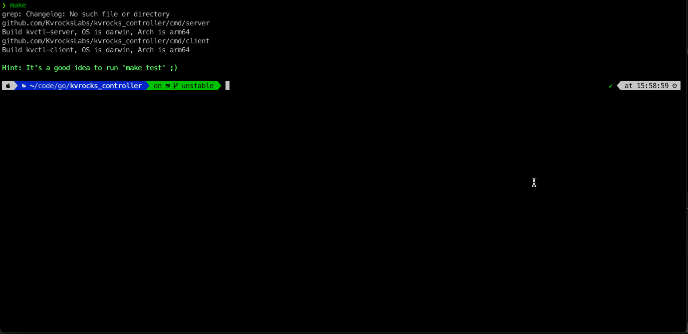

# Apache Kvrocks Controller

[](https://github.com/apache/kvrocks-controller/actions) [](https://goreportcard.com/report/github.com/apache/kvrocks-controller) [](https://codecov.io/gh/apache/kvrocks-controller)

Apache Kvrocks Controller is a cluster management tool for [Apache Kvrocks](https://github.com/apache/incubator-kvrocks), including the following key features:

* Failover - controller will failover or remove the master/slave node when probing failed
* Scale out the cluster in one line command
* Manage many clusters in one controller cluster
* Support multi metadata storages like etcd and so on

## Build and Running

### Requirements

* Go >= 1.19

### Build binaries

```shell
$ git clone https://github.com/apache/kvrocks-controller
$ cd kvrocks-controller
$ make # You can find the binary file in the `_build` dir if all goes good
```
### Overview

For the storage, the ETCD is used as the default storage now. Welcome to contribute other storages like MySQL, Redis, Consul and so on. And what you need to do is to implement the [Engine interface](https://github.com/apache/kvrocks-controller/blob/unstable/store/engine/engine.go).

### Supported Storage Engine

- [x] ETCD
- [x] Zookeeper
- [x] Embedded Storage based on Raft (experimental)

### Run the controller server

```shell
# Use docker-compose to setup the etcd or zookeeper
$ make setup
# Run the controller server
$ ./_build/kvctl-server -c config/config.yaml
```



### Run server with the raft embedding engine

> Note: The embedded Raft engine is still in the experimental stage, and it's not recommended to use it in the production environment.

Change the storage type to `raft` in the configuration file.

```yaml
storage_type: raft

raft:
  id: 1
  data_dir: "/data/kvrocks/raft/1"
  cluster_state: "new"
  peers:
    - "http://127.0.0.1:6001"
    - "http://127.0.0.1:6002"
    - "http://127.0.0.1:6003"
```

- id: the node id for the raft node, it's also an index in the peers list
- data_dir: the directory to store the raft data
- cluster_state: the state of the raft cluster, it should be `new` when the cluster is initialized. And it should be `existing` when the cluster is already bootstrapped.
- peers: the list of the raft peers, it should include all the nodes in the cluster.

And then you can run the controller server with the configuration file.

```shell
$ ./_build/kvctl-server -c config/config-raft.yaml
```

#### Add/Remove a raft peer node

We now support adding and removing via the HTTP API.

```shell
# Add a new peer node
curl -XPOST -d '{"id":4,"peer":"http://127.0.0.1:6004","operation":"add"}'  http://127.0.0.1:9379/api/v1/raft/peers

# Remove a peer node
curl -XPOST -d '{"id":4, "operation":"remove"}'  http://127.0.0.1:9379/api/v1/raft/peers

# List all the peer nodes
curl http://127.0.0.1:9379/api/v1/raft/peers
```

### Use client to interact with the controller server

```shell
# Show help
$ ./_build/kvctl --help

# Create namespace
$ ./_build/kvctl create namespace test-ns

# List namespaces
$ ./_build/kvctl list namespaces

# Create cluster in the namespace
$ ./_build/kvctl create cluster test-cluster --nodes 127.0.0.1:6666,127.0.0.1:6667 -n test-ns

# List clusters in the namespace
$ ./_build/kvctl list clusters -n test-ns

# Get cluster in the namespace
$ ./_build/kvctl get cluster test-cluster -n test-ns

# Migrate slot from source to target
$ ./_build/kvctl migrate slot 123 --target 1 -n test-ns -c test-cluster
```

For the HTTP API, you can find the [HTTP API(work in progress)](docs/API.md) for more details.

## License

Licensed under the [Apache License, Version 2.0](LICENSE)
