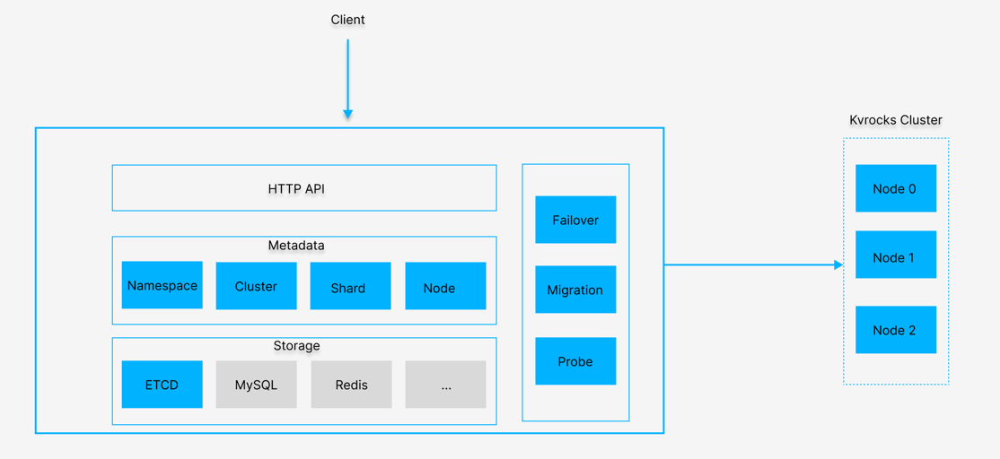

# Apache Kvrocks Controller

[](https://github.com/apache/kvrocks-controller/actions) [](https://goreportcard.com/report/github.com/apache/kvrocks-controller) [](https://codecov.io/gh/apache/kvrocks-controller)

Apache Kvrocks Controller is a cluster management tool for [Apache Kvrocks](https://github.com/apache/incubator-kvrocks), including the following key features:

* Failover - controller will failover or remove the master/slave node when probing failed
* Scale out the cluster in one line command
* Manage many clusters in one controller cluster
* Support multi metadata storages like etcd and so on

## Build and Running

### Requirements

* Go >= 1.19

### Build binaries

```shell
$ git clone https://github.com/apache/kvrocks-controller
$ cd kvrocks-controller
$ make # You can find the binary file in the `_build` dir if all goes good
# ---
# If you do not have a suitable Golang compilation environment locally, you can also use 'make BUILDER_IMAGE=<golang:version>' to choose a Golang image for compilation.
# $ make BUILDER_IMAGE=golang:1.20.3
```
### Overview

For the storage, the ETCD is used as the default storage now. Welcome to contribute other storages like MySQL, Redis, Consul and so on. And what you need to do is to implement the [Engine interface](https://github.com/apache/kvrocks-controller/blob/unstable/store/engine/engine.go).

### 1. Run the controller server

```shell
# Use docker-compose to setup the etcd or zookeeper
$ make setup
# Run the controller server
$ ./_build/kvctl-server -c config/config.yaml
```


### 2. Use the terminal client to interact with the controller server

```shell
# Show help
$ ./_build/kvctl --help

# Create namespace
$ ./_build/kvctl create namespace test-ns

# List namespaces
$ ./_build/kvctl list namespaces

# Create cluster in the namespace
$ ./_build/kvctl create cluster test-cluster --nodes 127.0.0.1:6666,127.0.0.1:6667 -n test-ns

# List clusters in the namespace
$ ./_build/kvctl list clusters -n test-ns

# Get cluster in the namespace
$ ./_build/kvctl get cluster test-cluster -n test-ns

# Migrate slot from source to target
$ ./_build/kvctl migrate slot 123 --target 1 -n test-ns -c test-cluster
```

For the HTTP API, you can find the [HTTP API(work in progress)](docs/API.md) for more details.

## License

Licensed under the [Apache License, Version 2.0](LICENSE)
